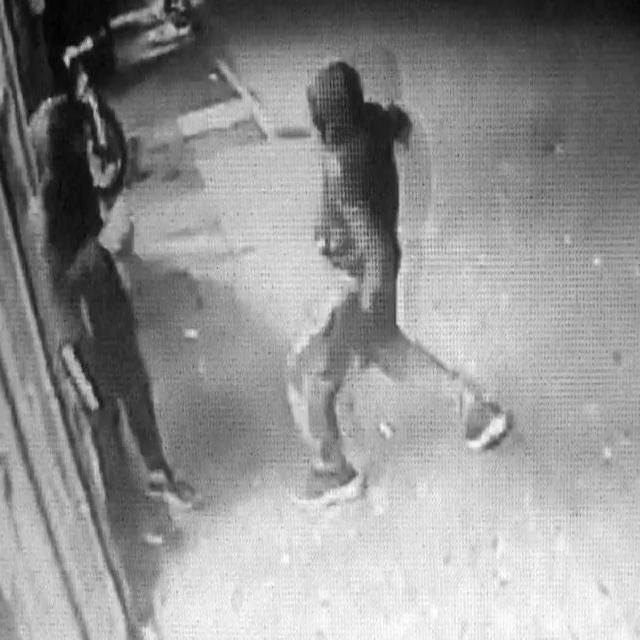
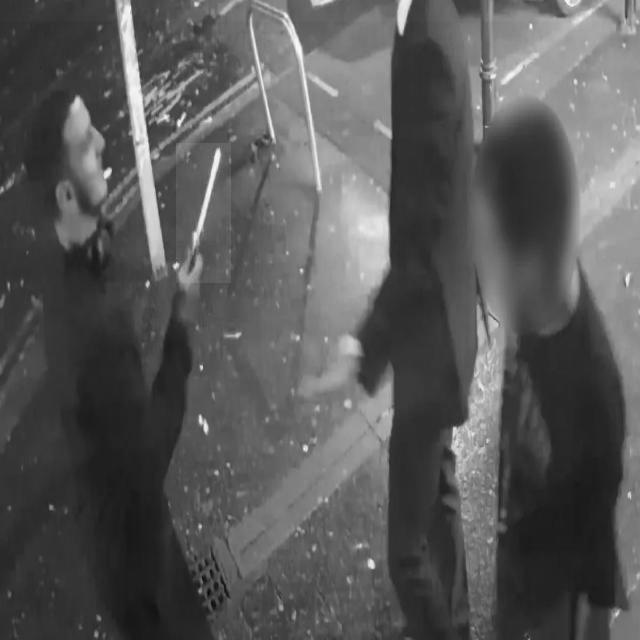

# Crime Detection with PyTorch Faster RCNN

## Introduction

This Model aims to do real-time crime detection using OpenCV and FasterRCNN_resnet50_fpn. The main motive is to loop over each image that passed through this model and detect a "Crime_Activity" if model captures crime_activity just bound that detection in a box. 

### Requirements
#### Install Libraries :

• Opencv-python --> Version = 4.8.0.74

• Numpy --> version = 1.26.4

• Torch and Torvision (latest version)

• Matplotlib, glob2, tqdm, albumentations (latest version)

## Results

#### Example -

#### Prediction -

#### Example (2) -

#### Prediction -

